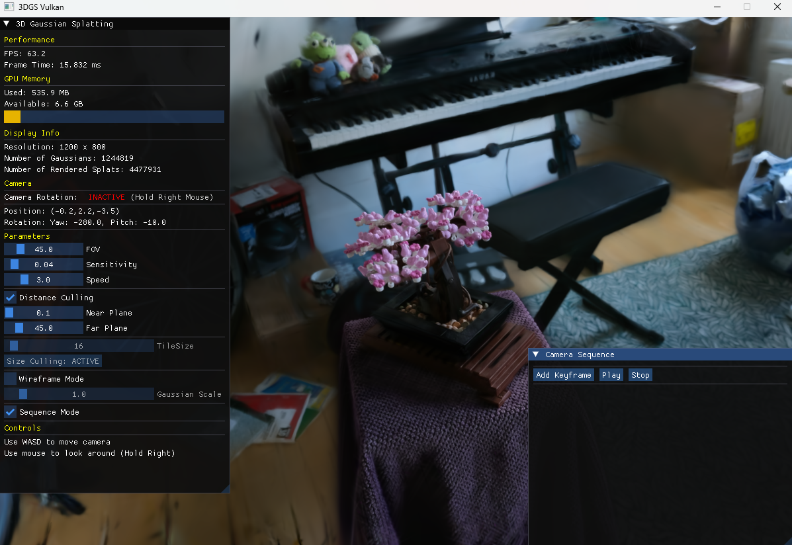

# Vulkan 3DGS Python

Run cross-platform Vulkan 3D Gaussian Splatting from Python - Windows/Mac/Linux, any GPU, no NVIDIA dependency.


*Vulkan 3DGS running on Windows. NVIDIA 3060 Ti*

This package provides Python bindings for [3dgs-vulkan-cpp](https://github.com/AlejandroAmat/3dgs-vulkan-cpp), a high-performance Vulkan-based 3D Gaussian Splatting renderer that works on any GPU vendor (NVIDIA, AMD, Intel, Apple Silicon).

## Features

- ✅ **Cross-platform**: Windows, macOS, Linux
- ✅ **Any GPU vendor**: No CUDA/NVIDIA dependency  
- ✅ **Easy installation**: Single pip command
- ✅ **Sample data included**: Automatic download of test PLY file
- ✅ **Real-time rendering**: 25-80 FPS on 2M+ Gaussians
- ✅ **Keyframe animation system**: Create smooth camera animations with interpolation

## Installation

### Prerequisites
- **Vulkan SDK 1.3+** - Download from https://vulkan.lunarg.com/
- **Python 3.8+**
  
### Install from Source
```bash
git clone --recursive https://github.com/AlejandroAmat/vulkan-3dgs-python.git
cd vulkan-3dgs-python
pip install -e . 
```

### Use as Submodule
If you want to integrate this into your own project:

```bash
# Add as submodule
git submodule add https://github.com/AlejandroAmat/vulkan-3dgs-python.git third-party/vulkan-3dgs-python
git submodule update --init --recursive

# Install the submodule
cd third-party/vulkan-3dgs-python
pip install -e .
cd ../..
```

The installation will:
- Build the Vulkan renderer from C++ source
- Download sample 3DGS data (bonsai.ply) automatically
- Create Python bindings ready to use

## Usage

### Basic Example
```python
import vulkan_3dgs

# Run with bundled sample data
vulkan_3dgs.run("vulkan_3dgs/data/bonsai.ply")

# Run with custom dimensions  
vulkan_3dgs.run("vulkan_3dgs/data/bonsai.ply", width=1920, height=1080)

# Run with your own PLY file
vulkan_3dgs.run("path/to/your/pointcloud.ply")
```

### Test Script
```bash
python scripts/test.py
```

### Controls
- **WASD** - Move camera
- **Q/E** - Move up/down  
- **Right Mouse + Drag / Two-finger drag (trackpad)** - Look around
- **ImGui interface** - Real-time parameter adjustment

## PLY File Format

The renderer expects standard 3D Gaussian Splatting PLY files. A sample file is automatically downloaded during installation.

**Need more data?** Check the [3DGS dataset collection](https://huggingface.co/datasets/dylanebert/3dgs/tree/main).

## Platform Notes

- **AMD GPUs**: Change `SUBGROUP_SIZE` to 64 in the radix sort shader if needed
- **M3/M4 Macs**: Some color format issues may occur - being addressed

## Requirements

- Vulkan 1.3+ compatible GPU and drivers
- Python 3.8+
- CMake (for building from source)

## License

MIT

## Related Projects

- [3dgs-vulkan-cpp](https://github.com/AlejandroAmat/3dgs-vulkan-cpp) - The underlying C++ renderer
- [Original 3D Gaussian Splatting](https://github.com/graphdeco-inria/gaussian-splatting) - CUDA-based reference implementation
